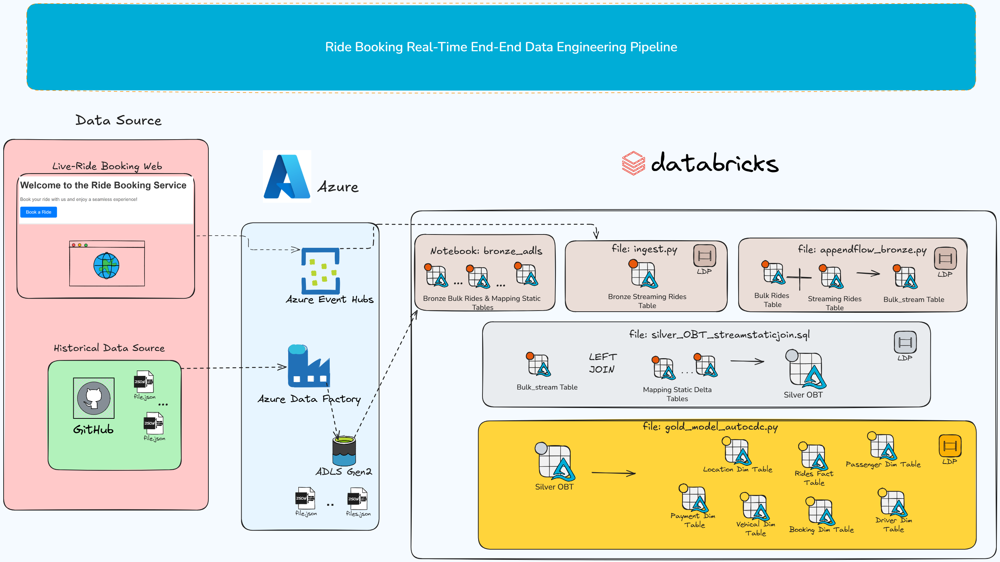
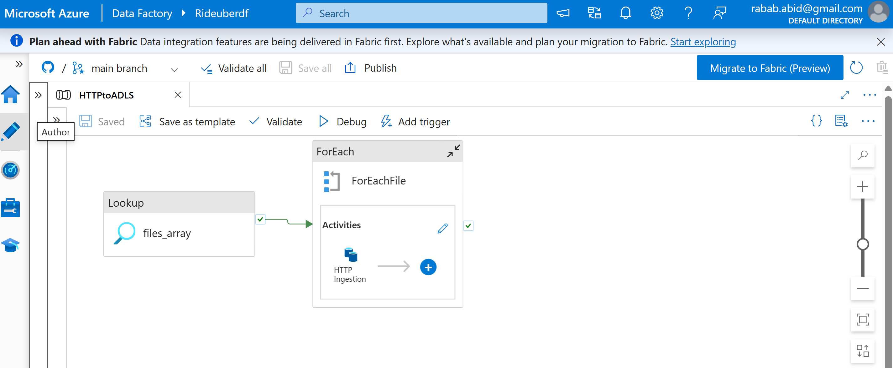
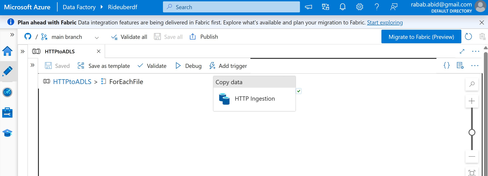
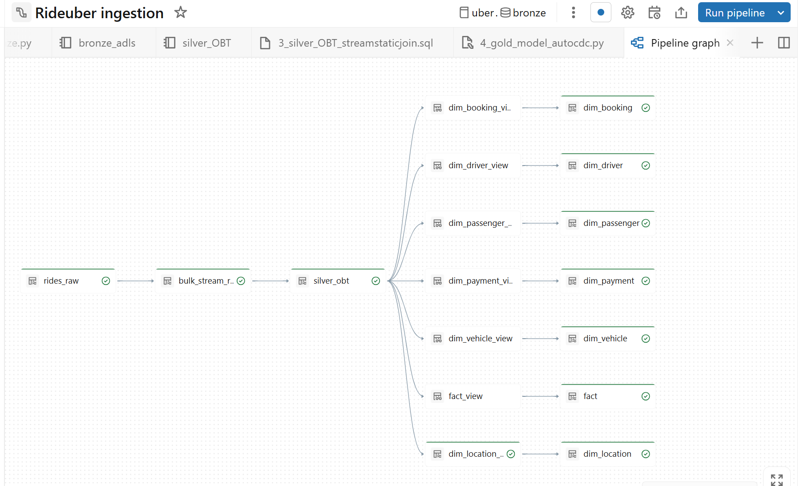
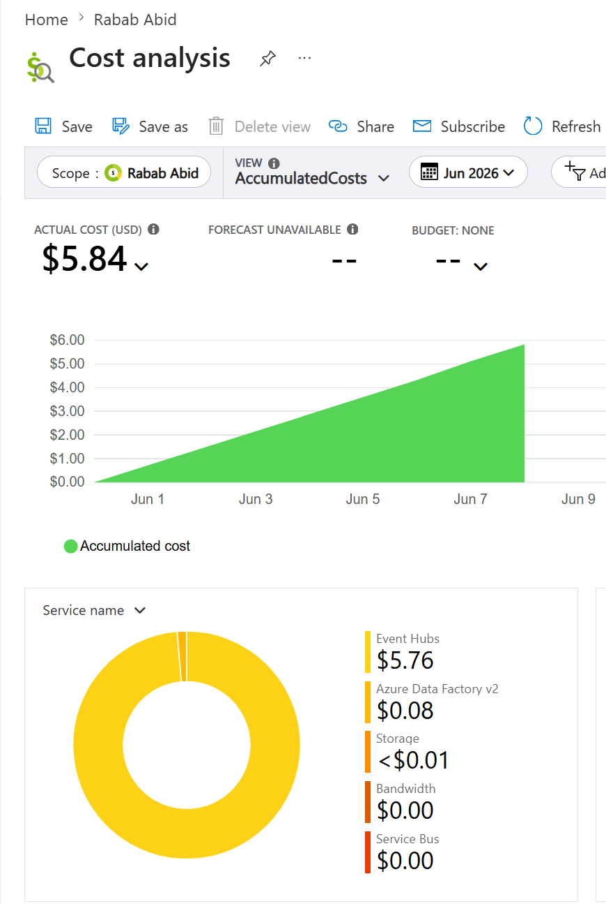

# Ride Booking Realtime End-End Data Engineering Project
 
## 📌 Project Overview
This project delivers a production-grade, end-to-end hybrid data engineering pipeline that processes real-time streaming ride transactions alongside multi-year batch historical fact data and static dimension lookups. 

The architecture bridges a localized, asynchronous event producer network with enterprise Azure cloud infrastructure and Databricks Delta Live Tables (DLT) / Spark Declarative Pipelines (SDP) to serve a fully optimized, history-tracking Star Schema Gold layer.

## 🏗️ System Architecture Diagram

*This diagram outlines the flow from asynchronous event producers to our cloud lakehouse compute engines.*

### 📺 Interactive Video Walkthrough

*Click the system architecture diagram above to watch the complete end-to-end pipeline execution video trace on YouTube!*

---

## 🛠️ Technical Stack & Architectural Layout
*   **Source Layer:** Local Python FastAPI runtime engine simulating heavy multi-user ride-hailing traffic.
*   **Streaming Ingestion:** Azure Event Hub (Functioning as an enterprise Apache Kafka layer) serving as a fault-tolerant, partition-isolated streaming buffer channel.
*   **Batch Ingestion:** Azure Data Factory (ADF) handling automated "Lift-and-Shift" batch copy activities via HTTP REST APIs to ingest historical bulk rides and mapping data.
*   **Storage Layer:** Azure Data Lake Storage Gen2 (ADLS Gen2) configured with `lookup/` file that has file names for the github raw files in array & `raw` container to land each of these files here).
*   **Compute & Unified Core:** Databricks Community Workspace executing distributed PySpark, Delta Live Tables (DLT), and Jinja-templated Spark SQL scripts.

---

## 🚀 Key Project Phases & Implementation Mechanics

### Phase 1: Real-Time Event Generation
Built a local FastAPI web server acting as a real-time stream producer. The application tracks passenger transactions, serializes payloads into clean JSON formats, and stream-pushes packets natively to Azure Event Hub over an authenticated, secure connection interface.

### Phase 2 & 3: Hybrid Orchestration & Storage
Configured Azure Data Factory pipelines to copy historical bulk rides & other mapping files from Github to ADLS Gen2. Implemented look-up activity to check the files array file from ADLS Gen2 that contains files list. Used ForEach activity to process this files array one by one to load historical data from Github dynamic relative URL using each file name with the help of Copy activity to paste it in ADLS Gen2 in same folder with dynamic file name.

### Phase 4 & 5: Stream-Batch Convergence (The DLT Append Flow)
Within the Databricks Delta Live Tables (DLT) compiler ecosystem, initialized stateful `readStream` pipelines. Leveraged the specialized `@dlt.append_flow` decorator to combine real-time Event Hub payloads with a one-time streaming initialization of historical `bulk_rides` Delta tables, ensuring a unified historical record timeline without causing processing redundancies.

### Phase 6 & 7: Jinja-Templated Silver OBT Stream-Static Joins
Designed an automated, stateless One Big Table (OBT) generation query script using Jinja-templated Spark SQL. The pipeline executes real-time, lightweight stream-static `LEFT JOIN` operations between our transaction stream and active lookup datasets.

### Phase 8: Gold Layer Dimensional Star Schema Modeling (SCD Type 1 & 2)
Denormalized the transaction OBT into an analytics-ready Dimensional Star Schema Model:
*   **Fact Tables:** Unified, deduplicated transactions tracked sequentially.
*   **SCD Type 1 Dimensions:** Implemented on entities like Passengers and Drivers. 
*   **SCD Type 2 Dimensions:** Implemented on evolving mapping attributes (like locations and city updates) using chronological `SEQUENCE BY` constraints to accurately track historical profiling shifts over time without deleting past transaction states.

##  LDP/SDP/DLT:
Below is the pipeline graph snapshot from Databricks, after completing phase 4- 8

## 💰 Project Cost Analysis: 
To keep cloud expenses low, this pipeline uses a mix of fixed and consumption-based pricing models. Below is the final live cost report totaling $5.84 USD.

 
### Azure Event Hubs ($5.76): 
Charged a flat hourly rate for 1 Throughput Unit (TU) to reserve a 1 MB/s data streaming lane, plus a minor usage fee per million events.
### Azure Data Factory v2 ($0.08): 
Serverless pricing. Charged strictly per pipeline trigger and for the exact minutes the data movement compute was active.
### Azure Storage (<$0.01): 
Charged based on the total gigabytes of data stored on disk and the number of read/write file operations.
### Bandwidth & Service Bus ($0.00): 
Free because all data stayed within the same Azure data center region.
 
